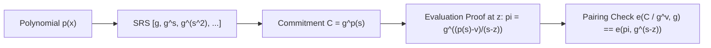

# KZG Polynomial Commitment Skill

High-efficiency, zero-dependency Python implementation of **KZG (Kate-Zaverucha-Goldberg) Polynomial Commitments**.

## Features
- **Constant Sized Commitments**: Encodes degree-\(d\) polynomials into single group elements.
- **Point Evaluation Openings**: Validates \(p(z) = v\) via quotient polynomial divisibility \((p(x) - v) / (x - z)\).
- **Zero External Dependencies**: Pure Python standard library.
- **Native MCP Protocol**: JSON-RPC 2.0 stdio server compatible with Claude Desktop, Cursor, and Windsurf.

## Architecture

